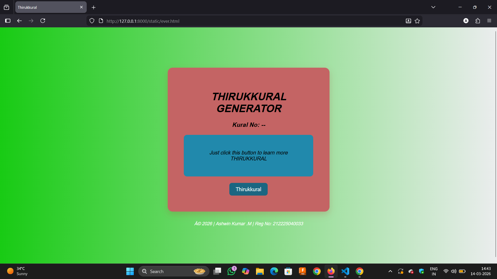

# Quote_Generator
## Date:14/03/2026
## Objective:
To create a simple thirukkural generator using HTML, CSS, and JavaScript that displays a new random thirukkural each time a button is clicked — similar to daily quote sections on blogs or productivity apps.

## Tasks:

### 1. Create the HTML Structure:
<ul>
  <li>Add a heading Thirukkural Generator</li>
  <li>Use a div or p to display the Thirukkural (Tamil couplet).</li>
  <li>Use another p or span to display the meaning or explanation.</li>
  <li>Add a button labeled “Get Thirukkural”.</li>
  <li>Add a label showing the Kural number.</li>
</ul>

### 2. Style the Layout Using CSS:

<ul>
  <li>Center everything on the page using Flexbox.</li>
  <li>Style the quote box with:
  <ul type="square">
    <li>Padding</li>
    <li>Background color</li>
    <li>Rounded borders</li>
    <li>Soft shadow</li>
    <li>Add hover effects for the button.</li>
  </ul>
  </li>
</ul>

### 3. Add JavaScript Functionality:
<ul>
  <li>Store an array of Thirukkural objects containing:
  <ul type="square">
    <li>Kural number</li>
    <li>Kural Meaning</li>
  </ul>
  </li>
  <li>When the button is clicked:
  <ul type="square">
    <li>Generate a random index using Math.random().</li>
    <li>Retrieve the corresponding Thirukkural object.</li>
    <li>Display the Kural number and meaning in the HTML.</li>
    <li>Update content dynamically using innerText.</li>
  </ul>
  </li>
</ul>

## Code:
```
<html>
<head>
<title>Thirukkural</title>

<style>

body{
    font-family: Arial;
    background: linear-gradient(to right,#18cb14,#ebedee);
    height:100vh;
    display:flex;
    justify-content:center;
    align-items:center;
    font-style: oblique;
}

.wrapper{
    display:flex;
    flex-direction:column;
    align-items:center;
}

.container{
    text-align:center;
    background:rgb(196, 100, 100);
    padding:50px;
    border-radius:15px;
    box-shadow:0 8px 20px rgba(172, 35, 35, 0.2);
    width:400px;
}

#kuralBox{
    margin:20px 0;
    padding:30px;
    background:#2189ac;
    border-radius:10px;
}

button{
    padding:10px 20px;
    border:none;
    border-radius:8px;
    background:#1b6681;
    color:white;    
    font-size:16px;
    cursor:pointer;
    transition:0.3s;
}

button:hover{
    background:#2e2f7d;
}

footer{
    margin-top:15px;
    text-align:center;
    color:white;
    font-size:14px;
}

</style>

</head>

<body>

<div class="wrapper">

<div class="container">

<h1>THIRUKKURAL GENERATOR</h1>

<h3 id="number">Kural No: --</h3>

<div id="kuralBox">
<p id="kural">Just click this button to learn more THIRUKKURAL</p>
<p id="meaning"></p>
</div>

<button onclick="generateKural()">Thirukkural</button>

</div>
<br>
<br>


<footer>
<p>© 2026 | Ashwin Kumar .M | Reg No: 212225040033</p>
</footer>

</div>

<script>

const kurals = [

{
number:1,
kural:"Agaram mudhala ezhuthellam Aadhi Bhagavan mudhatre ulagu.",
meaning:"As the letter 'A' is the first of all letters, so the eternal God is first in the world."
},

{
number:2,
kural:"Manathukkan maasilan aadhal Anaiththu aram aagum.",
meaning:"What use is learning if one does not worship the feet of God?"
},

{
number:3,
kural:"Iniya ulavaga innadha kooral Kani iruppa kaai kavarnthatru.",
meaning:"Those who follow the feet of God will live long on earth."
},

{
number:4,
kural:"Karka kasadara karpavai katrapin Nirka adharku thaga.",
meaning:"Those who surrender to God will not suffer."
},

{
number:5,
kural:"Epporul yaar yaar vaai ketpinum Apporul meipporul kaanbadhu arivu.",
meaning:"Those who praise God are free from good and bad deeds."
}

];

function generateKural(){

let randomIndex = Math.floor(Math.random()*kurals.length);

let selected = kurals[randomIndex];

document.getElementById("number").innerText = "Kural No: " + selected.number;

document.getElementById("kural").innerText = selected.kural;

document.getElementById("meaning").innerText = selected.meaning;

}

</script>

</body>
</html>
```

## Output:

## Result:
A simple quote generator using HTML, CSS, and JavaScript that displays a new random motivational quote each time a button is clicked — similar to daily quote sections on blogs or productivity apps is created successfully.
